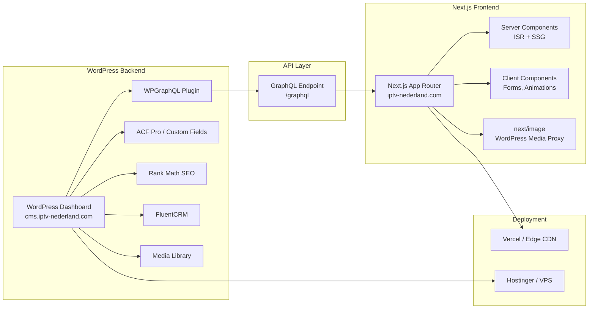
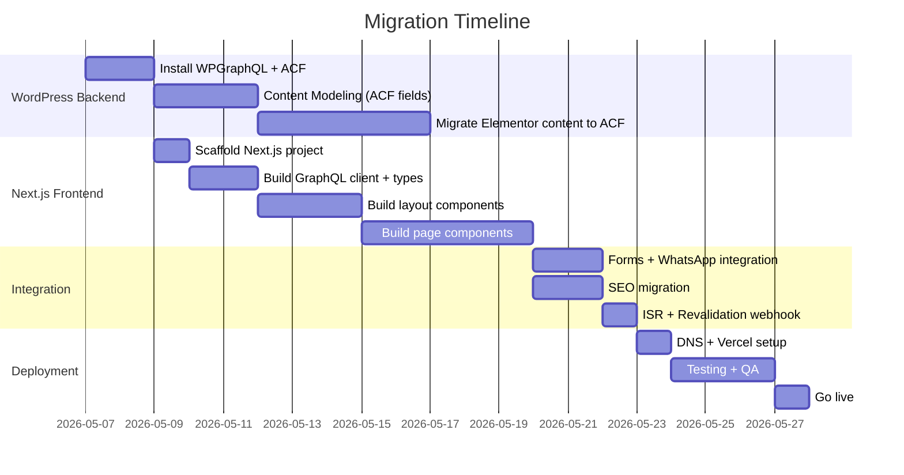

# Headless WordPress + Next.js Migration — iptv-nederland.com

Migrate from a monolithic WordPress/Elementor site to a decoupled architecture: WordPress as a headless CMS (dashboard only) and Next.js as the frontend.

---

## Current Site Audit

| Layer | Current Stack |
|---|---|
| **Theme** | `IPTV-Nederland` child theme → `hello-elementor` parent |
| **Page Builder** | Elementor + Elementor Pro (all pages built with Elementor widgets) |
| **SEO** | Rank Math |
| **Email/CRM** | FluentCRM + FluentCampaign Pro + Fluent SMTP |
| **Forms** | Contact Form 7 |
| **Security** | Wordfence + Block Bad Queries |
| **Performance** | Seraphinite Accelerator, WP Rocket (`WP_CACHE` enabled) |
| **Tracking** | WooCommerce Google Ads Conversion Tracking Tag |
| **WhatsApp** | Click to Chat for WhatsApp |
| **Media** | Uploads in `/wp-content/uploads/` (2023, 2024, 2026 dirs) |
| **DB** | `iptv_nederland` on MySQL, ~51MB SQL dump |
| **Hosting (prod)** | Hostinger (LiteSpeed, paths show `/home/u386438928/`) |
| **Local Dev** | Laragon on Windows |

---

## User Review Required

> [!IMPORTANT]
> **Elementor Content Loss**: All your pages are built with Elementor. In a headless setup, Elementor widgets won't render on the Next.js frontend. We need to decide how to handle this:
> - **Option A**: Recreate all pages manually in Next.js components (recommended for best performance & control)
> - **Option B**: Use ACF + Gutenberg blocks to re-model content in WordPress, then consume via GraphQL
> - **Option C**: Keep some pages as raw HTML/content in WordPress custom fields, render in Next.js

> [!WARNING]
> **WooCommerce**: You have the Google Ads Conversion Tracking plugin for WooCommerce, and WooCommerce upload artifacts exist. Do you currently use WooCommerce for products/checkout? If yes, we need to plan for headless WooCommerce (via WooGraphQL or REST API). If not, we can skip it.

> [!IMPORTANT]
> **FluentCRM/Forms**: FluentCRM and Contact Form 7 are server-side WordPress plugins. In headless mode:
> - Forms will be custom Next.js components submitting to a WordPress REST/GraphQL endpoint
> - FluentCRM stays on WordPress backend (it works independently of the frontend)

---

## Open Questions

1. **Which pages does the site have?** (Home, Pricing, About, Contact, Blog, etc.) — I can't extract Elementor page content programmatically. Please list the main pages/sections.
2. **Do you use WooCommerce for actual e-commerce?** Or is it just the tracking plugin?
3. **Where will WordPress be hosted?** Same Hostinger server as a subdomain (e.g., `cms.iptv-nederland.com`) or keep it on the main domain behind a path?
4. **Where will Next.js be hosted?** Vercel (recommended, free tier available), Netlify, or self-hosted on Hostinger?
5. **Do you want a blog section?** If yes, we'll set up blog post fetching via GraphQL with ISR.
6. **Multi-language support?** The site name is Dutch — do you need i18n?

---

## Proposed Architecture



---

## Proposed Changes

### Phase 1: WordPress Backend Setup (Headless CMS)

#### [MODIFY] WordPress — Install & Configure Headless Plugins

Install the following plugins on the existing WordPress instance:

| Plugin | Purpose |
|---|---|
| **WPGraphQL** | Expose all WordPress data via a GraphQL API |
| **WPGraphQL for ACF** | Expose ACF fields in GraphQL schema |
| **WPGraphQL for Rank Math SEO** | Expose SEO meta (title, description, OG tags) via GraphQL |
| **Advanced Custom Fields (ACF) Pro** | Structured content modeling to replace Elementor |
| **WPGraphQL CORS** | Handle CORS for Next.js ↔ WordPress communication |

#### [MODIFY] `wp-config.php` — Add Headless Constants

```php
// Headless WordPress Configuration
define('HEADLESS_MODE_CLIENT_URL', 'https://iptv-nederland.com');
define('GRAPHQL_JWT_AUTH_SECRET_KEY', 'your-secret-key-here');
```

#### [NEW] Headless Theme — `headless-iptv`

Create a minimal WordPress theme that disables the frontend entirely and redirects all non-API traffic to the Next.js frontend:

```
wp-content/themes/headless-iptv/
├── functions.php      # Redirect frontend, register menus, enable GraphQL features
├── index.php          # Minimal fallback
└── style.css          # Theme header only
```

#### Content Modeling with ACF

Replace Elementor content with structured ACF field groups:

| Content Type | ACF Fields |
|---|---|
| **Homepage** | Hero (title, subtitle, CTA, background), Features list, Pricing cards, Testimonials |
| **Pricing Page** | Plan cards (name, price, features array, CTA) |
| **Contact Page** | Form config, WhatsApp number, business info |
| **Blog Post** | Standard WP post + featured image + SEO fields |

---

### Phase 2: Next.js Frontend Scaffolding

#### [NEW] `frontend/` — Next.js App (in workspace root)

```
c:\laragon\www\iptv-nederland.com\frontend\
├── .env.local                    # WordPress GraphQL URL
├── next.config.ts                # Image domains, rewrites
├── tsconfig.json
├── package.json
├── public/
│   ├── favicon.ico
│   └── fonts/
├── src/
│   ├── app/
│   │   ├── layout.tsx            # Root layout, fonts, metadata
│   │   ├── page.tsx              # Homepage
│   │   ├── pricing/
│   │   │   └── page.tsx
│   │   ├── contact/
│   │   │   └── page.tsx
│   │   ├── blog/
│   │   │   ├── page.tsx          # Blog listing
│   │   │   └── [slug]/
│   │   │       └── page.tsx      # Single post (ISR)
│   │   ├── api/
│   │   │   ├── revalidate/
│   │   │   │   └── route.ts      # On-demand ISR webhook
│   │   │   └── contact/
│   │   │       └── route.ts      # Form submission proxy
│   │   └── not-found.tsx
│   ├── lib/
│   │   ├── wordpress.ts          # GraphQL client & queries
│   │   ├── queries/
│   │   │   ├── pages.ts          # Page queries
│   │   │   ├── posts.ts          # Blog post queries
│   │   │   ├── menus.ts          # Navigation queries
│   │   │   └── seo.ts            # Rank Math SEO queries
│   │   └── types.ts              # TypeScript interfaces
│   ├── components/
│   │   ├── layout/
│   │   │   ├── Header.tsx
│   │   │   ├── Footer.tsx
│   │   │   └── Navigation.tsx
│   │   ├── ui/
│   │   │   ├── Button.tsx
│   │   │   ├── Card.tsx
│   │   │   └── PricingCard.tsx
│   │   ├── sections/
│   │   │   ├── Hero.tsx
│   │   │   ├── Features.tsx
│   │   │   └── Testimonials.tsx
│   │   └── forms/
│   │       └── ContactForm.tsx
│   └── styles/
│       └── globals.css
```

#### Key Implementation Details

**GraphQL Client (`src/lib/wordpress.ts`)**:
```typescript
const API_URL = process.env.WORDPRESS_GRAPHQL_URL!;

export async function fetchGraphQL<T>(
  query: string,
  variables?: Record<string, unknown>
): Promise<T> {
  const res = await fetch(API_URL, {
    method: "POST",
    headers: { "Content-Type": "application/json" },
    body: JSON.stringify({ query, variables }),
    next: { revalidate: 60 }, // ISR: revalidate every 60s
  });

  const json = await res.json();
  if (json.errors) throw new Error(json.errors[0].message);
  return json.data;
}
```

**Blog Post Page with ISR (`src/app/blog/[slug]/page.tsx`)**:
```typescript
export const revalidate = 60;

export async function generateStaticParams() {
  const posts = await getAllPostSlugs();
  return posts.map((slug) => ({ slug }));
}

export async function generateMetadata({ params }: Props): Promise<Metadata> {
  const { slug } = await params;
  const post = await getPostBySlug(slug);
  return {
    title: post.seo?.title ?? post.title,
    description: post.seo?.metaDesc,
    openGraph: { images: [post.featuredImage?.sourceUrl] },
  };
}
```

**Image Optimization (`next.config.ts`)**:
```typescript
const nextConfig: NextConfig = {
  images: {
    remotePatterns: [
      {
        protocol: "https",
        hostname: "cms.iptv-nederland.com", // WordPress media domain
        pathname: "/wp-content/uploads/**",
      },
    ],
  },
};
```

---

### Phase 3: SEO Migration

#### Rank Math → Next.js Metadata API

Query Rank Math SEO data via WPGraphQL for Rank Math:

```graphql
query GetPostSEO($slug: ID!) {
  post(id: $slug, idType: SLUG) {
    seo {
      title
      metaDesc
      opengraphTitle
      opengraphDescription
      opengraphImage { sourceUrl }
      canonical
      schema { raw }
    }
  }
}
```

Map to Next.js `generateMetadata()` on every page for full SEO parity.

#### Sitemap & Robots

- Use `next-sitemap` or the built-in Next.js `sitemap.ts` to generate sitemaps from GraphQL data
- Redirect old WordPress sitemap URLs to new sitemap location

---

### Phase 4: Forms & Integrations

| Feature | Implementation |
|---|---|
| **Contact Form** | Next.js `<ContactForm>` client component → POST to `/api/contact/` route → Forward to WordPress REST API (CF7 endpoint or custom endpoint) |
| **WhatsApp Chat** | Pure client-side component — no WordPress dependency |
| **FluentCRM** | Stays on WordPress backend, triggered by form submissions |
| **Google Ads Tracking** | Move to Next.js via `next/script` + Google Tag Manager |

---

### Phase 5: Deployment Strategy

```mermaid
graph TD
    A[WordPress CMS] -->|Host on| B[Hostinger<br/>cms.iptv-nederland.com]
    C[Next.js Frontend] -->|Deploy to| D[Vercel<br/>iptv-nederland.com]
    B -->|GraphQL API| D
    B -->|Webhook on publish| E[/api/revalidate]
    E -->|Trigger ISR| D
```

#### DNS Configuration

| Record | Type | Value |
|---|---|---|
| `iptv-nederland.com` | CNAME | `cname.vercel-dns.com` (Next.js) |
| `cms.iptv-nederland.com` | A | Hostinger server IP (WordPress) |

#### WordPress Webhook → On-Demand ISR

When content is updated in WordPress, trigger Next.js revalidation:

```typescript
// src/app/api/revalidate/route.ts
import { revalidatePath } from "next/cache";
import { NextRequest, NextResponse } from "next/server";

export async function POST(req: NextRequest) {
  const secret = req.headers.get("x-revalidate-secret");
  if (secret !== process.env.REVALIDATION_SECRET) {
    return NextResponse.json({ error: "Unauthorized" }, { status: 401 });
  }

  const { path } = await req.json();
  revalidatePath(path);
  return NextResponse.json({ revalidated: true });
}
```

---

### Phase 6: Plugin Cleanup

After migration, these WordPress plugins can be **removed** (frontend-only concerns now handled by Next.js):

| Remove | Reason |
|---|---|
| Elementor + Elementor Pro | No frontend rendering needed |
| ElementsKit Lite | Elementor addon |
| Essential Addons for Elementor | Elementor addon |
| Unlimited Elements for Elementor | Elementor addon |
| Hello Elementor theme | Replaced by headless theme |
| Seraphinite Accelerator | Frontend caching — Next.js handles this |
| WP Rocket | Frontend caching — Next.js handles this |
| Block Bad Queries | Move security to Cloudflare/Vercel edge |

**Keep** on WordPress:

| Keep | Reason |
|---|---|
| WPGraphQL (new) | API layer |
| ACF Pro (new) | Content modeling |
| Rank Math | SEO data source |
| FluentCRM + Fluent SMTP | Email marketing |
| Wordfence | WordPress admin security |
| Contact Form 7 | Backend form processing |

---

## Verification Plan

### Automated Tests

1. **GraphQL Schema Validation**: Run introspection query against `cms.iptv-nederland.com/graphql` to verify all content types are exposed
2. **Next.js Build**: `npm run build` must complete without errors and generate static pages
3. **Lighthouse Audit**: Run Lighthouse on deployed frontend — target 90+ on all metrics
4. **SEO Parity Check**: Compare old Rank Math meta tags with Next.js `<head>` output for each page

### Manual Verification

1. Update a post in WordPress dashboard → verify it appears on Next.js frontend within 60s (ISR)
2. Submit the contact form → verify FluentCRM receives the lead
3. Test all navigation links and 404 handling
4. Verify Open Graph previews on social media sharing debuggers
5. Check Google Search Console for indexing issues post-migration

---

## Execution Order


